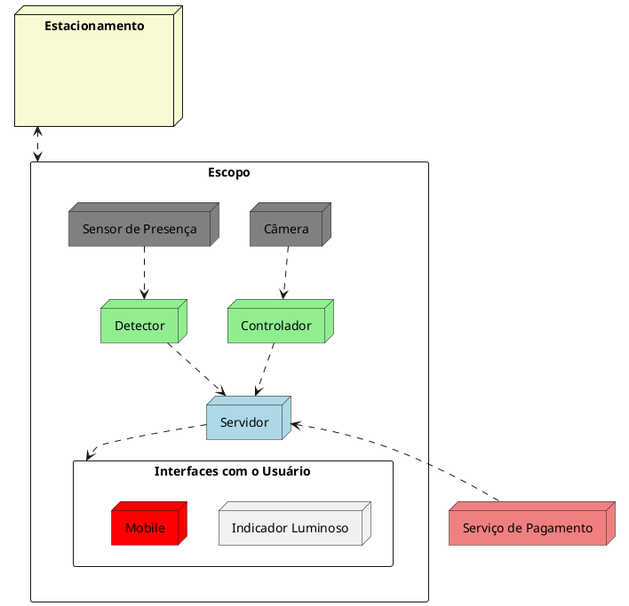

# EasyPark
## Escopo
Serviço para estacionamentos inteligentes, tanto o serviço de detecção de 
vagas quanto o serviço de gerenciamento de entrada e saída de veículos de 
forma totalmente autônoma. 

### Cenário / Problema
Atualmente, muitos estacionamentos enfrentam limitações significativas devido à falta de serviços eficazes para a indicação autônoma de vagas disponíveis e para o gerenciamento autônomo de entrada e saída de veículos. Mesmo nos casos em que há serviços, eles muitas vezes são insuficientes para atender às necessidades dos usuários e otimizar a experiência de estacionamento. Essa falta de tecnologia eficiente resulta em um processo demorado e ineficiente, causando frustração para os motoristas e dificultando o gerenciamento eficaz dos recursos do estacionamento.

### Objetivos da solução
Inclui:
1. Integrar de forma segura e com alta disponibilidade sensores (Sendores de Presença e Câmeras) e seus respectivos serviços, gerenciamento autônomo de entrada e saída de veículos e indicação autônoma de vagas disponíveis.
2. Interfaces de contato com o usuário. Interface mobile para acesso aos serviços, indicador luminoso para identificar vagas disponíveis facilmente e totens de pagamento para possibilitar o pagamento do serviço do estacionamento pelo usuário. 
3. Integração com serviço de pagamento. A fim de recebimento dos valores a respeito do serviço de estacionamento prestado. Integração tanto com a aplicação movel quanto com totens de pagamento.
4. Serviço de gerenciamento autônomo da entrada e saída de veículos.
5. Serviço de indicadores autônomos de vagas disponíveis.    

### Identificação dos Stakeholders e suas Perspectivas
- Proprietário do Estacionamento: 
    - Interesse em reduzir custos de instalação e operação.
    - Decisões arquiteturais: utilização de tecnologias escaláveis e modulares, como servidores centralizados e sensores eficientes.

- Usuários (Motoristas):
    - Necessidade de confiabilidade e facilidade de uso.
    - Decisões arquiteturais: desenvolvimento de um aplicativo mobile intuitivo e indicadores visuais de vagas disponíveis.
- Fornecedores de Tecnologia
    - Demandam integração de hardware e software com APIs padronizadas.
    - Decisões arquiteturais: adoção de protocolos de comunicação universal, para suportar dispositivos heterogêneos.

### Aspectos e Preocupações
- Escalabilidade
- Segurança
- Interoperabilidade
- Experiência do Usuário
- Sustentabilidade

### Modelo conceitual 

### Visão de Sistemas

### Caso de uso: Entrada de um veículo
O cliente Paulo está prestes a entrar no estacionamento da loja INF. Paulo para o carro ao lado da cancela eletrônica que realiza uma série de operações antes de liberar a entrada de Paulo e seu veículo. Essas operações incluem capturar a placa do veículo de Paulo, por meio de uma câmera, registrar o valor da placa, o horário de entrada e o número de série do ticket, em uma base centralizada do estacionamento, imprimir o ticket, e, posteriormente, abrir a cancela (liberar a entrada). 

### Apresentação 
[Vídeo de apresentação do escopo do projeto](https://drive.google.com/file/d/1sEWrQXcwfz3eq_hUq61phkcs8Gcy-TOY/view?usp=sharing)
